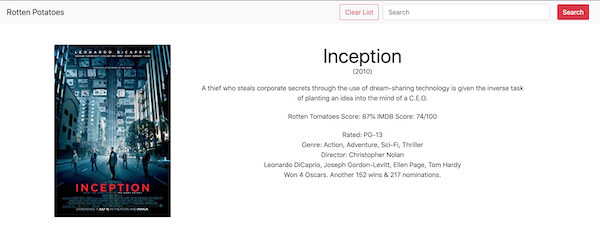

# RottenPotatoes
https://josephscottwilliams.github.io/RottenPotatoes/

## Work in progress...

### Technologies being used:
- HTML
- CSS
- Bootstrap
- Javascript
- jQuery
- Ajax

### API:
OMDB  
http://omdbapi.com/

### How to Use:
User may use input to search movie by title, response to search will be loaded at the top of their screen!  
Response includes movie poster, title user is searching for, year it was released, short synopsis, actors, director, Ratings from Rotten Tomatoes and IMDb
